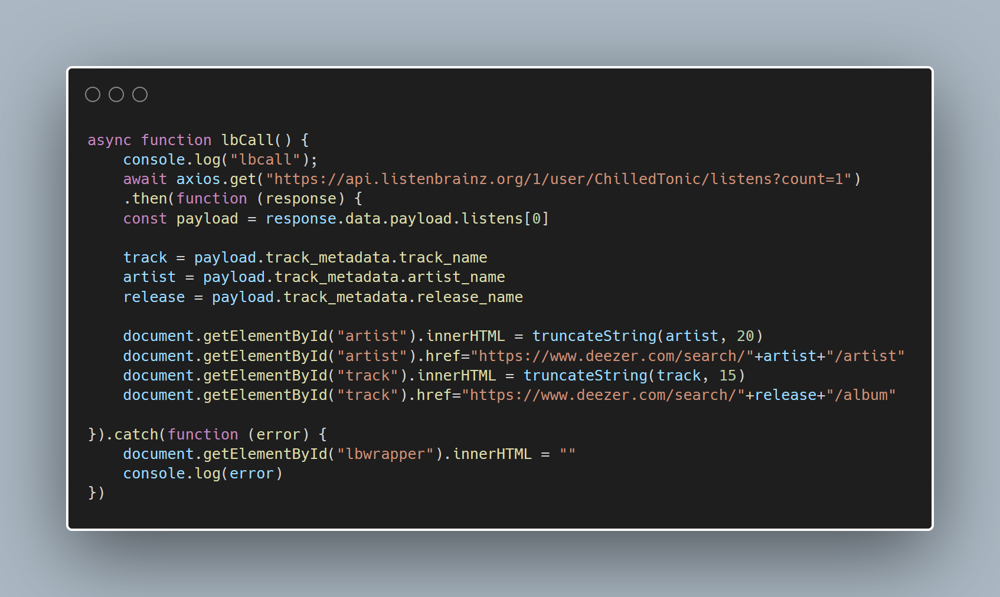

A big feature I wanted on this blog was the ability for people to see what music I was listening to _right now_; and you can see the finished results on the header of this page.

This blog is written in Hugo, which means unlike traditional blog engines, it renders the pages server-side, flat file - no database. These posts are actual MD files.

This means that getting something to update on page load is _not_ possible in plain HUGO - as far as is my understanding of the tool; which is limited! I'm still new to this.

But that's alright; We can do it in plain JavaScript - well, almost.

## Setup & _The Code_

I chose to use ListenBrainz as my scrobble host; they're open source and free, but most importantly in this case - their API is simple to use and requires no authentication for read-only requests. If you wanted to edit this code for Last.FM or another host, it'd be fairly straightforward.

Secondly, I chose to use the [Axios library](https://github.com/axios/axios) over other methods of interacting with REST APIs in JavaScript; the others are either inconvenient or must be [Polyfilled](https://polyfill.io/v3/) to work for all versions of browsers - and I prefer being as compatible as possible.

We write a quick and dirty truncate function to shorten responses that are too long, so as not to stretch out the page - and we're done.

Here's the dirty code for it all:

```javascript
function truncateString(str, num) {
    // If the length of str is less than or equal to num
    // just return str--don't truncate it.
    if (str.length <= num) {
      return str
    }
    // Return str truncated with '...' concatenated to the end of str.
    return str.slice(0, num) + '...'
  }

async function lbCall() {
    await axios.get("https://api.listenbrainz.org/1/user/ChilledTonic/listens?count=1")
    // Make the GET callout to ListenBrainz
    .then(function (response) {
    const payload = response.data.payload.listens[0]
    //shorten the lengthy response
    track = payload.track_metadata.track_name
    artist = payload.track_metadata.artist_name
    release = payload.track_metadata.release_name
    //set trackname, artist, etc;
    document.getElementById("artist").innerHTML = truncateString(artist, 20)
    document.getElementById("artist").href="https://www.deezer.com/search/"+artist+"/artist"
    document.getElementById("track").innerHTML = truncateString(track, 15)
    document.getElementById("track").href="https://www.deezer.com/search/"+release+"/album"
    //fill the page with the latest track information; truncate titles that are too long
}).catch(function (error) {
    document.getElementById("lbwrapper").innerHTML = ""
    console.log(error)
})
```

The HTML looks like this:

```html
<div id="lbwrapper">
    Follow me on <a href="https://listenbrainz.org/user/ChilledTonic">ListenBrainz</a>; I last listened to <a id="track" href="#"></a> by <a id="artist" href="#"></a>.
</div>
```

## Conclusion

I'm fairly happy with how this turned out. It's quick and dirty, but it does what I ask of it - and is far simpler then other suggestions to complete the same task I've seen floating around.

Check out my fork of [Archie](https://github.com/chilledtonic/archie) if you want to see how this sort of plugin would work with Hugo.