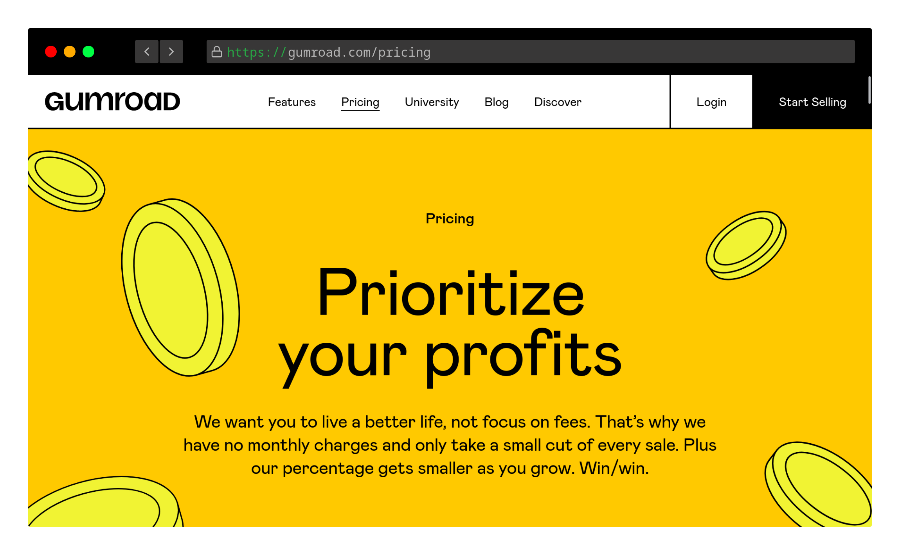

I was recently investigating [gumroad](https://gumroad.com) and was quite pleased with their [new design system](https://gumroad.com/blog/behind-gumroads-new-design-system). I liked how all their features were summed up as simple taglines ("Go from zero to $1", as an example), and how the vibrant color pallet drew me between each explanitory diagram.

At the time, I googled "Gumroad design scheme" and came up empty with a name for it. However, weeks later, I noticed [Figma](https://www.figma.com/) did a similar design for their own website. Two is a trend, so I sought out what this design system was called and found [this article](https://hype4.academy/articles/design/neubrutalism-is-taking-over-web), which called it Neubrutalism.

## What is Neubrutalism? What is Brutalism?

Neubrutalism is a web design trend which attempts to apply aspects of the [1950's brutalist design philosophy](https://en.wikipedia.org/wiki/Brutalist_architecture) to web design. Brutalism, in summary, was a trend in architecture which focused on minimalist, geometrical designs, often associated with unpainted exposed concrete. [people like to argue about the nomenclature](https://news.ycombinator.com/item?id=31107467) and the exact specifics of the trend itself - but that's true of all design styles.

It's often associated with the utilitarian and socialist philosophies that were in focus during that decade, but that's not a hard requirement either.

## Why Neubrutalism?

The web is suffering from a [readability problem](https://www.wired.com/2016/10/how-the-web-became-unreadable/). Much like the collapse of the [Open Office](https://www.mute.design/2021/12/07/open-office-concept-fixed/) - where Frank Loyd Webber's 1906 design plans got misunderstood and simplified over decades, where now modern open offices frequently become a cacophonous mess - minimalist web design tools like [Material Design](https://material.io/design) and [Bootstrap](https://material.io/design) have been utilized to create user experiences which utilize the _styles_ of these tool-sets without understanding the _underlying thought_.

I'm going to call these "poser sites", although I don't necessarily mean it derogatorily.

These poser sites look the part of the design trends they borrow from, but ignore what these design trends are trying to solve - As an example, Material Design is to simplify navigation, reduce eye strain from low-contrasting text, and maintain the same navigation schemes across different device sizes. Many sites look the part, but remain difficult to read and navigate.

I won't call anyone out with examples. I'm sure you can think of a few favorites.

Neubrutalism comes into play here as a _new system of design thought_, at least within the web space. It borrows from not only the architectural stylings of the original Brutalist school of thought, but also from early HTML1 web designs, which in themselves were recreations of tangible, modern type setting and printing methods.

It has the opportunity to be misunderstood, like all design trends before it - but since it's so radically different from the prior design trends of the last decade, it also has the opportunity to redefine how we build websites that are not just beautiful to look at, but are also concise, easy to read, and simple to navigate.

## How do I Neubrutalize?

These haven't been set in stone yet - the school is still _extremely new_, and I think a lot of designers haven't even realized they're contributing to Neubrutalism themselves, yet.

However, I have devised a few rules I apply to my own Neubrutalist designs.

1. Use solid, "un-infused" colors.

    There is a long-standing rule in webdesign to not use pure black (#fff) and white (#000) as your background colors - an attempt to reduce eyestrain while reading. In moderation this is good, but misused it can actually decrease readability if the colors chosen do not have enough contrast between them.

    Neubrutalism rejects this by using "pure" color codes wherever possible, and solves the contrast issue by using near-conflicting colors on the color wheel. Readability is preserved by reducing the saturation (to roughly 80%) of these tones.

2. Avoid blur, use sharp shadows.

    Shadows are not dithered into oblivion, but are instead sharp, black and opaque, frequently at 45 degree angles.

3. Reduce your pallette

    Frequently Neubrutalist sites reduce their color pallette to a maximum of four conflicting colors, not including black and white.

4. Border elements you wish to focus with black

    Anything that the user should interact with (buttons, text boxes) or focus on (dialog boxes, tooltips) should be highlighted with opaque black borders.

5. Alignment is non-critical, but define your edges.

    By bordering your focused elements and using bright colors, perfect alignment is not as critical. Asymmetry can be utilized as a design element to further focus the eye to what's most important. This creates a "diy" look, which works well for sites and products that want to convey that users can replicate or design their own works.

    Think photocopied zines, as an example of where misalignment has worked in the tangible world.
    
It is important to use these rules with critical thinking and align them with modern [web accessability](https://www.w3.org/WAI/fundamentals/accessibility-intro/) guidelines. Ensure your text is readable and your colors contrast neatly.

Browsing the [#neubrutalism hashtag](https://twitter.com/hashtag/neubrutalism), I find using the above rules are a good way to sort out quality examples versus "poser" designs.

Finally, it's good to reiterate that I am not the design czar. These rules have been a good framework for my own work, but this style is new, exciting, and not fully developed - There is ample opportunity to experiment, try different things, and break the rules.

## Examples in the wild

-  [Gumroad](https://gumroad.com/), the payment processor for hobbyists
-  [Figma](https://www.figma.com/), the multi-user design tool
-  [Pizza Pizza Design Services](https://pizzapizza.io/), a digital product design agency
- This very blog that you are on, [cannedfi.sh](https://cannedfi.sh)

Also be sure to browse [dribble](https://dribbble.com/search/neubrutalism) and [twitter](https://twitter.com/hashtag/neubrutalism), both good sources for the most recent examples in the trend.

## Further Thoughts

I haven't even begun to touch on ideas I've noticed repeatedly trend in modern web engineering - things like JavaScript-less static site generation, rejection of tools such as SASS and TypeScript, and the focus on creating simple, ultra-lightweight websites with minimal styling and deep cross-compatibility between devices and browsers, from GUI to CLI.

I believe these are examples of Neubrutalism as well, although I feel that the underlying (dare I say _socialist_, in the best of ways) philosophies of these two trends have generated independently of each other and have yet to combine together - but we're beginning to see it start - and I lack the words, currently, to surmise exactly what I'm seeing.

For examples of Neubrutalism beyond web design, look to these:

1. [uxn](https://100r.co/site/uxn.html), the assembly language - and everything [100 Rabbits](https://100r.co) has ever done
2. Drew DeVault's [sourcehut](https://sr.ht/), and it's connected projects - especially the [gamja irc client](https://sr.ht/~emersion/gamja/)
3. [Webmentions](https://indieweb.org/Webmention) and the [Indieweb movement](https://indieweb.org/)
4. [neocities](https://neocities.org/) and the [tildeverse](https://tildeverse.org/)
5. the modern resurgence of the [bbs](https://enigma-bbs.github.io/) and it's [games](https://jackphla.sh/darkness/).

These examples may conflict with the rules I have outlined above, in many ways - but it's an attempt to convey the cross-discipline trend I've been noticing. I apologize if this is not as clear, or completely contradicts, the rest of the article.

